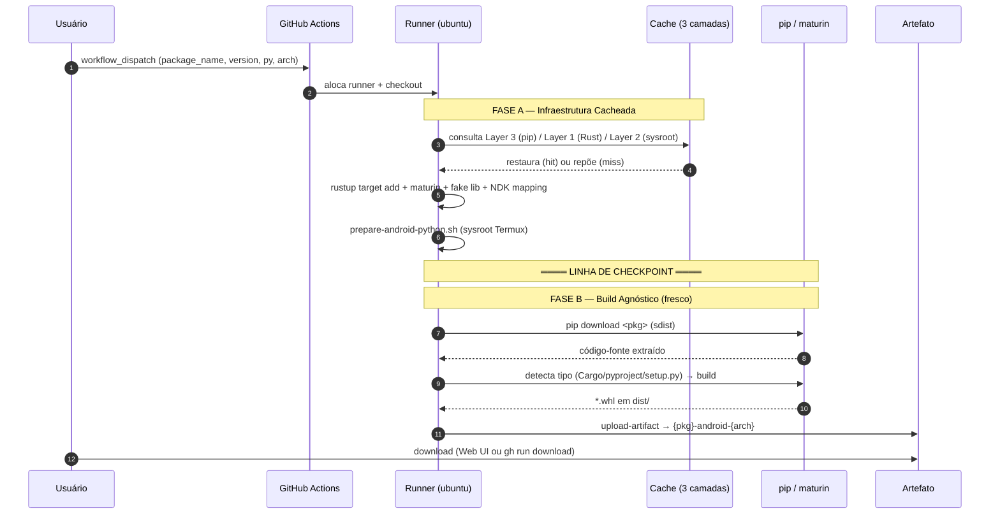
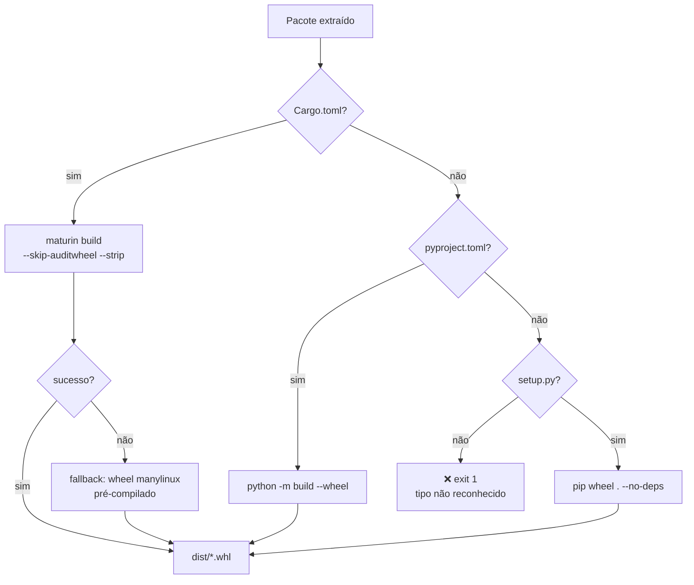

# SEQUENCIADOR — Fábrica de Wheels Android

Documento canônico do fluxo de build de wheels Python para Android/Termux.
Workflow único de origem da verdade: `.github/workflows/android-wheel.yml`.

Este documento descreve, de ponta a ponta, como um pacote PyPI entra como
entrada e sai como um wheel `.whl` instalável no Termux — quais partes são
infraestrutura cacheada (idêntica para todo pacote) e quais rodam frescas a
cada build.

---

## 1. Contrato de Interface

O workflow é disparado manualmente (`workflow_dispatch`) com quatro parâmetros.

### Entradas (`workflow_dispatch.inputs`)

| Parâmetro          | Obrigatório | Padrão    | Descrição                                                        |
|--------------------|:-----------:|:---------:|------------------------------------------------------------------|
| `package_name`     | sim         | —         | Nome do pacote no PyPI (ex.: `jiter`, `pydantic-core`, `orjson`). |
| `package_version`  | não         | `''`      | Versão exata. **Vazio = versão mais recente** disponível no PyPI. |
| `python_version`   | sim         | `3.12`    | Versão Python que deve casar com o Python instalado no Termux.   |
| `arch`             | não         | `aarch64` | Arquitetura alvo: `aarch64`, `x86_64`, `armv7l`, `i686`.          |

### Saída

- **Artefato** (GitHub Actions) nomeado `{package_name}-android-{arch}`.
- **Conteúdo**: um ou mais arquivos `*.whl` em `dist/`.
- **Retenção**: 30 dias (`retention-days: 30`).
- **Disponibilidade**: Web UI (Actions → run → Artifacts) **e** CLI local (`gh`).
- **Falha explícita**: se nenhum `.whl` for gerado, o step de upload falha com erro (`if-no-files-found: error`) — nunca um sucesso silencioso sem artefato.

### Assinatura

```
f(package_name, package_version?, python_version, arch?) → artefato "{package_name}-android-{arch}"
                                                          contendo {name}-{ver}-cp3XX-cp3XX-linux_{arch}.whl
                                                          (ou {name}-{ver}-py3-none-any.whl para pure-python)
```

> O `cp3XX` (ex.: `cp312`) deriva de `python_version`. Para Rust/maturin o wheel
> carrega o tag `linux_{arch}`; `--skip-auditwheel` impede que o auditwheel o
> rejeite por não ser manylinux.

---

## 2. Leis da Infraestrutura (Hardcoded)

Estas seis invariantes são **fixas** — não são parâmetros. São o que torna o
cross-compile para Android possível e são idênticas para todo pacote.

### Lei 1 — `ANDROID_API: 24`

- **O quê**: nível mínimo de API do Android (Android 7.0).
- **Por que hardcoded**: define o sufixo do toolchain do NDK
  (`{triple}24-clang`). É o menor API amplamente compatível com o NDK atual e
  não varia por pacote.
- **Onde**: `env.ANDROID_API` no job (linha 29 do workflow); propagado para o
  nome do linker em `CARGO_TARGET_*_LINKER`, `CC_*`, `CXX_*` e para o argumento
  `$2` de `prepare-android-python.sh`.

### Lei 2 — `PYO3_NO_PYTHON_LINKING: 1`

- **O quê**: força o PyO3 (bindings Rust↔Python) a **não linkar** contra
  `libpython` em tempo de compilação.
- **Por que hardcoded**: no Android, o `libpython` real só existe em runtime
  (dentro do app Termux). Linkar em build-time falha. Os símbolos são
  resolvidos em runtime pela VM Python hospedeira.
- **Onde**: `echo "PYO3_NO_PYTHON_LINKING=1" >> $GITHUB_ENV` (linha 68).

### Lei 3 — Estratégia de Biblioteca Falsa (Fake Library)

- **O quê**: cria um `libpython{ver}.so` **vazio** (stub) num diretório
  `fake_libs/` e instrui o linker a aceitá-lo ignorando símbolos não resolvidos.
- **Por que hardcoded**: o linker (`rust-lld` via clang do NDK) exige encontrar
  `libpython3.XX.so` durante o link. Sem a versão real disponível para Android,
  o stub satisfaz a exigência nominal e as flags fazem o linker não validar os
  símbolos — eles serão providos em runtime.
- **Onde**:
  - `mkdir -p fake_libs && touch fake_libs/libpython${PYTHON_VER}.so` (linhas 104–105).
  - `RUSTFLAGS=-L {workspace}/fake_libs -C link-arg=-Wl,--unresolved-symbols=ignore-all -C link-arg=-Wl,--allow-shlib-undefined` (linha 106).

### Lei 4 — Mapeamento do Toolchain NDK (arch → triple)

- **O quê**: cada `arch` mapeia para um LLVM triple e um conjunto de variáveis
  de ambiente que apontam o compilador/linker do NDK.
- **Por que hardcoded**: o NDK fornece um binário pré-construído por triple;
  o Rust precisa saber exatamente qual `*-clang`/`*-clang++` chamar.
- **Onde** (bloco `case` linhas 73–94, exports linhas 96–98):

  | `arch`  | LLVM triple (`LLVM_TRIPLE`)     | CARGO triple                        |
  |---------|---------------------------------|-------------------------------------|
  | aarch64 | `aarch64-linux-android`         | `AARCH64_LINUX_ANDROID`             |
  | x86_64  | `x86_64-linux-android`          | `X86_64_LINUX_ANDROID`              |
  | armv7l  | `armv7a-linux-androideabi`      | `ARMV7A_LINUX_ANDROIDEABI`          |
  | i686    | `i686-linux-android`            | `I686_LINUX_ANDROID`                |

  Define: `CARGO_TARGET_{CARGO_TRIPLE}_LINKER`, `CC_{LLVM_TRIPLE}`, `CXX_{LLVM_TRIPLE}`.

### Lei 5 — `--skip-auditwheel`

- **O quê**: desativa o auditwheel no maturin (que normalmente valida/repara
  wheels contra o padrão manylinux).
- **Por que hardcoded**: Android **não é** manylinux. O auditwheel rejeitaria o
  wheel por tags/`glibc` não-conformes. O wheel Android é válido por construção.
- **Onde**: `MATURIN_BUILD_ARGS=--target {triple} --skip-auditwheel --strip -i python{ver}`
  setado por `prepare-android-python.sh` e consumido em `maturin build $MATURIN_BUILD_ARGS`.

### Lei 6 — `--strip`

- **O quê**: remove símbolos de debug do binário final.
- **Por que hardcoded**: reduz drasticamente o tamanho do `.so` (Android é
  sensível a tamanho de APK/app). Irrelevante para correção, essencial para uso prático.
- **Onde**: incluso em `MATURIN_BUILD_ARGS` (junto com `--skip-auditwheel`).

---

## 3. Sequência do Fluxo

O workflow está dividido em duas fases lógicas. A **linha de checkpoint** fica
entre elas: tudo acima é restaurável do cache; tudo abaixo roda fresco a cada pacote.

### FASE A — Infraestrutura Cacheada (package-agnóstica)

Estado idêntico para todo `(python_version, arch)`. Restaurado do cache em hits.

| #  | Step (nome no workflow)               | O que faz                                                              | Cache                          | Env vars que seta                                              |
|----|----------------------------------------|------------------------------------------------------------------------|--------------------------------|----------------------------------------------------------------|
| 1  | 📥 Checkout Repository                 | Clona o repo (`actions/checkout@v4`).                                  | —                              | —                                                              |
| 2  | 🐍 Setup Python                        | Instala Python `python_version` + ativa cache pip (`setup-python@v5`). | **Layer 3** (pip)              | —                                                              |
| 3  | 📱 Setup Android NDK                   | Instala o NDK (`setup-android@v3`).                                    | NDK (cache interno da action)  | `ANDROID_NDK_HOME`, `ANDROID_NDK_ROOT`                        |
| 4  | ⚡ Cache Rust Toolchain                | Restaura `~/.cargo/registry`, `~/.cargo/git/db`, `~/.rustup`.          | **Layer 1** (Rust)             | —                                                              |
| 5  | 🦀 Setup Rust & PyO3 Env               | `rustup target add $TARGET`, `pip install maturin`, mapeia NDK.        | consome Layer 1/3              | `PYO3_PYTHON`, `PYO3_NO_PYTHON_LINKING`, `CARGO_TARGET_*_LINKER`, `CC_*`, `CXX_*` |
| 6  | 📚 Create Fake libpython               | Cria o stub `libpython{ver}.so` + define `RUSTFLAGS`.                  | —                              | `RUSTFLAGS`                                                    |
| 7  | 📦 Cache Android Python Sysroot        | Restaura `$SYSROOT_DIR`.                                               | **Layer 2** (sysroot)          | —                                                              |
| 8  | 🐍 Prepare Android Python Sysroot      | Baixa/extracta o `.deb` Python do Termux (ou reusa do cache).          | consome Layer 2                | `PYO3_CROSS_LIB_DIR`, `PYO3_CROSS_PYTHON_VERSION`, `MATURIN_BUILD_ARGS` |

> Variável de infraestrutura de caminho: `SYSROOT_DIR = {github.workspace}/.cache/android-sysroot`
> (job-level `env`, linha 32). O `prepare-android-python.sh` respeita esse valor
> quando já está populado — no cache hit, ele encontra `libpython*.so` e pula o download.

### FASE B — Build Agnóstico (roda fresco)

Depende da entrada `package_name`/`package_version`. Não é cacheável por design.

| #  | Step (nome no workflow) | O que faz                                                                 |
|----|--------------------------|---------------------------------------------------------------------------|
| 9  | 🏗️ Download & Build Wheel| `pip download` (sdist) → extrai → detecta tipo de projeto → builda.        |
| 10 | 📤 Upload Wheel Artifact | Publica `dist/*.whl` como artefato `{package_name}-android-{arch}`.        |

**Árvore de detecção de tipo de projeto** (dentro do step 9):

```
Pacote extraído
  ├── Cargo.toml existe?      → 🦀 maturin build $MATURIN_BUILD_ARGS --out ../../dist
  │                                └── falhou? → fallback: baixa wheel manylinux pré-compilada
  ├── pyproject.toml existe?  → 🐍 pip install build && python -m build --wheel --outdir ../../dist
  ├── setup.py existe?        → 🐍 pip wheel . -w ../../dist --no-deps
  └── nenhum dos três         → ❌ exit 1 (tipo não reconhecido)
```

- **Versão**: `package_version` vazio dispara `pip download "$PKG"` (mais recente);
  não-vazio dispara `pip download "$PKG==$VER"`.
- **Fallback (apenas Rust)**: se `maturin build` falhar, tenta baixar um wheel
  manylinux pré-compilado (`manylinux_2_34_aarch64` etc.) que pode funcionar no
  Termux via `patchelf`. É melhor-esforço: o step de upload ainda exige um `.whl`.

---

## 4. Estratégia de Checkpoint

**Princípio**: cacheia TODO o estado de infraestrutura até o ponto onde a
entrada específica do pacote entra. No segundo run com o mesmo
`(python_version, arch)`, a Fase A é restaurada e só o build do pacote roda fresco.

> _Tudo acima da linha de checkpoint é restaurado do cache. Tudo abaixo roda fresco._

### Camadas de Cache

| Camada | O que cacheia                                  | Caminho                                  | Cache key                                              | Tamanho aprox. | Custo de cache-miss |
|:------:|-------------------------------------------------|------------------------------------------|--------------------------------------------------------|:--------------:|:-------------------:|
| 1      | Toolchain Rust + índice/cache do cargo registry | `~/.cargo/registry/{index,cache}`, `~/.cargo/git/db`, `~/.rustup` | `rust-{TARGET}-py{python_version}` (restore: `rust-{TARGET}-`, `rust-`) | ~300–400 MB    | ~60–90 s            |
| 2      | Sysroot Python Android (deb + extraído)         | `$SYSROOT_DIR` (`{workspace}/.cache/android-sysroot`) | `sysroot-{arch}-py{python_version}`            | ~15–20 MB      | ~5–10 s             |
| 3      | Cache de download do pip                        | `~/.cache/pip` (via `setup-python` `cache: 'pip'`) | hash de `requirements-build.txt` (âncora)            | ~30–80 MB      | ~5–15 s             |

> O **NDK** (step 3) é cacheado internamente pela action `setup-android`, fora
> destas três camadas.

**Por que as chaves são package-agnósticas**: nenhuma chave depende de
`package_name`/`package_version` nem de `hashFiles('**/Cargo.*')` (os arquivos
`Cargo.*` vivem dentro do sdist baixado, não no repo). Assim, o hit de cache é
determinado apenas por `(arch, python_version)` — exatamente o que define a infraestrutura.

**Efeito do checkpoint**: num segundo run com o mesmo `(python_version, arch)`:
- Layer 1 → `rustup target add` vira no-op, `pip install maturin` é no-op.
- Layer 2 → `prepare-android-python.sh` encontra o sysroot populado e **pula** o `curl`/extração do `.deb`.
- Layer 3 → `pip download` do pacote é mais rápido (cache de download).
- NDK → restaurado pela própria action.

Resultado: a Fase A cai de ~2–3 min para ~15–30 s no cache hit.

> **Decisão de design**: o diretório `target/` (build Cargo por pacote) foi
> **removido** das chaves de cache — ele não é reusável entre pacotes diferentes.
> Cacheá-lo poluiria o cache sem benefício.

---

## 5. Uso — Web e CLI Local

### Web UI

1. Repo → aba **Actions**.
2. Workflow **Android Wheel Factory** → **Run workflow**.
3. Preencha: `package_name`, `package_version` (ou deixe vazio), `python_version`, `arch`.
4. Após concluir → abra o run → **Artifacts** → baixe `{package_name}-android-{arch}`.

### CLI Local (`gh`)

Requer `gh` autenticado (`gh auth login`) com acesso ao repo.

```bash
# 1) Disparar o workflow
gh workflow run android-wheel.yml \
  -f package_name=jiter \
  -f package_version=0.12.0 \
  -f python_version=3.12 \
  -f arch=aarch64

# 2) Esperar a execução concluir
gh run watch

# 3) Baixar o artefato (substitua <run-id> pelo ID exibido em `gh run list`)
gh run download <run-id> -n jiter-android-aarch64
```

> `package_version` e `arch` são opcionais (têm padrão). Disparo mínimo:
> `gh workflow run android-wheel.yml -f package_name=jiter -f python_version=3.12`

### One-liner (dispara, espera, baixa)

```bash
gh workflow run android-wheel.yml -f package_name=jiter -f python_version=3.12 -f arch=aarch64 && \
  sleep 3 && \
  gh run download $(gh run list --workflow=android-wheel.yml --limit=1 --json databaseId -q '.[0].databaseId') -n jiter-android-aarch64
```

> O `sleep 3` dá tempo ao GitHub de registrar o run antes de consultá-lo.

---

## 6. Replicação para Qualquer Módulo

O workflow **já é agnóstico**: nenhum nome de pacote está hardcoded. Para buildar
um pacote diferente, basta mudar as entradas — a detecção de tipo de projeto
(step 9) cuida do resto.

| Pacote PyPI      | `package_name`   | `package_version` | `python_version` | `arch`    | Tipo detectado     | Ferramenta         |
|------------------|------------------|-------------------|------------------|-----------|--------------------|--------------------|
| jiter            | `jiter`          | `0.12.0`          | `3.12`           | `aarch64` | Rust (`Cargo.toml`)| maturin            |
| pydantic-core    | `pydantic-core`  | `2.27.2`          | `3.12`           | `aarch64` | Rust (`Cargo.toml`)| maturin            |
| orjson           | `orjson`         | `3.10.12`         | `3.12`           | `aarch64` | Rust (`Cargo.toml`)| maturin            |

- **Pacotes pure-Python** (`pyproject.toml`/`setup.py`) também funcionam: o step 9
  detecta e despacha para `python -m build` ou `pip wheel`. Esses não usam o
  toolchain Rust/NDK — produzem wheels `py3-none-any`.
- **Versão omitida** (`package_version` vazio) baixa sempre a mais recente do PyPI.
- **Outras arquiteturas**: mude `arch` (`x86_64`, `armv7l`, `i686`); o mapeamento
  NDK (Lei 4) e a chave de cache se adaptam automaticamente.

---

## 7. Diagrama de Sequência

### Fluxo de ponta a ponta



### Árvore de detecção de tipo de projeto



---

## Apêndice — Mapa de Arquivos

| Arquivo                              | Papel                                                       |
|--------------------------------------|-------------------------------------------------------------|
| `.github/workflows/android-wheel.yml`| Workflow canônico (única origem da verdade do pipeline).     |
| `.github/scripts/prepare-android-python.sh` | Baixa/prepara o sysroot Python Android; respeita `SYSROOT_DIR` do env. |
| `requirements-build.txt`             | Âncora da chave de cache do pip (`maturin`).                |
| `SEQUENCIADOR.md`                    | Este documento.                                             |
